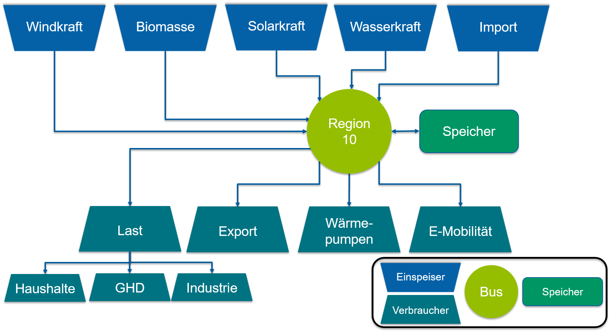

.. _Aufbau_Energiesystem_label:

Aufbau des Energiesystems
=========================

Die Berechnungen im Tool Energiewende regionalisieren umfassen die Stromerzeugung, den Strombedarf sowie die Speicherung von elektrischer Energie über ein gesamtes Kalenderjahr in der Region 10. Dafür wurde ein Energiesystemmodell entwickelt, das mit Hilfe einer linearen Optimierung gelöst wird. Der Aufbau des Energiesystems und die Optimierung wurden in der Programmiersprache Python unter Verwendung des Python Frameworks `oemof <https://oemof.readthedocs.io/en/stable/index.html>`_
umgesetzt. Oemof steht für Open Energy System Modelling Framework und ist ein Open Source Framework unter der MIT Licence (Copyright (c) 2014-2021, oemof developer group) für die Modellierung, Optimierung und Analyse von Energiesystemen. Entwickelt wurde es in einer Kollaboration des Zentrums für nachhaltige Energiesysteme (ZNES – Uni/Hochschule Flensburg), der Universität Magdeburg und dem Reiner Lemoine Institut (RLI).

Modelltopologie
---------------

Das Energiesystemmodell ist aufgebaut aus Erzeugern und Verbrauchern, die an Busse angeschlossen werden können, an denen ein Energieaustausch stattfindet. Die Busse sind dabei so konzipiert, dass sich ein Gleichgewicht von Energieerzeugung und Energieverbrauch einstellt. Mit diesem Modell wird ein lineares Optimierungsproblem erstellt, welches mit Hilfe eines Solvers gelöst wird. Die Modelltopologie für das Energiesystemmodell des Tools Energiewende regionalisieren kann der Grafik entnommen werden. Als Bus fungiert die Region 10, angeschlossen an ihn sind die Erzeuger (Solarkraft, Windkraft, Biomasse, Wasserkraft, Import), Verbraucher (Energiebedarf Haushalte, Industrie, Gewerbe, Wärmepumpen, Elektromobilität, Export) sowie Speicher. Eingangsparameter für das Modell sind dabei die durch den User einstellbaren Größen beispielsweise die installierte Solarleistung oder der Strombedarf durch Ausbau der Elektromobilität sowie bereits vorberechnete Daten wie z. B. Zeitreihen basierend auf Wetterdaten und Bedarfswerten. Der Zeitraum der Optimierung erstreckt sich über einen Zeitraum von einem Kalenderjahr in Zeitschritten von einer Stunde. Im linearen Optimierungsproblem, welches aus den gegebenen Randbedingungen erstellt wird, sind die Zustände aller Komponenten des Energiesystems zu jedem Zeitpunkt bekannt. Es handelt sich um ein so genanntes Perfect Foresight Verfahren. Als Ergebnis berechnet das Energiesystemmodell eine stündlich aufgelöste Energie- und Leistungsbilanz für die Region 10.

