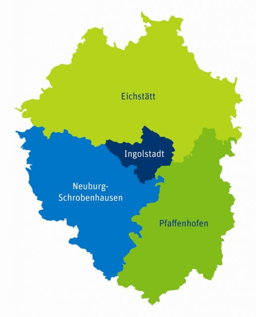

.. _Beschreibung_label:

Über das Tool
================

Eine erfolgreiche Energiewende in der Region 10 kann nur gemeinsam geschafft werden. Dazu müssen alle Interessensgruppen Ihre Meinungen, Visionen und Bedürfnisse einbringen können. Aber wie kann das gewährleistet werden? Wie können komplexe Sachverhalte und Zukunftsszenarien der Energiewende visualisiert werden? Wie kann die Meinung eines Einzelnen Einfluss auf die weitere Gestaltung der Energiewende haben? Die Technische Hochschule Ingolstadt (THI) hat im Rahmen des Projekts Mensch in Bewegung ein Energiewende-Tool für die Region 10 entwickelt, welches es ermöglicht diese Fragen zu beantworten und einen Beteiligungsprozess an der Energiewende für alle Interessensgruppen anstoßen kann.

Mit dem Tool „Energiewende regionalisieren“ können Sie Ihre eigenen Einstellungen zur Entwicklung der Energiewende in der Region 10 tätigen. Dabei werden Ihnen Optionen zum Ausbau der Erneuerbaren Energien sowie zur Entwicklung des Strombedarfs, Sektorkopplung und Batteriespeichern gegeben. Die Folgen Ihrer gewählten Einstellungen werden Ihnen anhand einer Karte der Region sowie mehrerer Grafiken dargestellt. Dabei sehen Sie nicht nur Ihre eigene Energiewendevision, sondern auch den Vergleich zur allgemeinen Meinung der Bevölkerung in der Region 10. 

Die Region 10 besteht aus den Landkreisen Eichstätt, Neuburg-Schrobenhausen, Pfaffenhofen a.d. Ilm und der kreisfreien Stadt Ingolstadt (siehe Bild - Quelle: `IRMA e. V. <https://www.irma-ev.de/>`_)

Motivation
----------

Die Entwicklung einer nachhaltigen Energieversorgung und –nutzung, kurz Energiewende, bringt zukünftig relevante Veränderung, auch in der Region 10 mit sich. Dabei werden beinahe alle Gesellschaftsgruppen (Stakeholder) damit in irgendeiner Weise und in unterschiedlicher Ausprägung konfrontiert. Diese umfangreichen Eingriffe umfassen unter anderem Private Lebensabläufe (gesteuerte Stromverbraucher, Elektromobilität, variable Energietarife), Kostenstrukturen (höhere Kosten in Phasen niedriger erneuerbarer Energiebereitstellung, Energieeinsparung), Veränderung des Landschaftsbilds (z. B. durch Windkraftanlagen, Biogasanlagen, Photovoltaikanlagen oder Strommasten) sowie Berufsbilder und deren Arbeitsabläufe (in Abhängigkeit des Stromangebots gesteuerte Produktionsprozesse, Umweltmanagement, etc.). Diese aus Klimaschutzgründen notwendige Veränderung gilt es als Dialogprozess zwischen den Stakeholdern zu organisieren, um eine nachhaltige Entwicklung durch hohe Akzeptanz auf Grund von Wissen zu etablieren. Durch diesen Ansatz können die Veränderungen mittels der Energiewende durch die Gesellschaft stärker gestaltet und somit nachhaltig in die Gesellschaft implementiert werden.

Ziele
-----

Das im Projekt Mensch in Bewegung entwickelte Tool „Energiewende Regionalisieren“ hat das Ziel die Diskussion zwischen den Stakeholdern der Region 10 zu aktivieren. Ziel des Vorhabens ist es nicht ein konkretes Energiewendekonzept für diese Region zu erarbeiten, sondern viel mehr den einzelnen Gesellschaftsgruppen jeweils ihre eigene Energiewendevision in der Region zu veranschaulichen (regionale Energiewendevision). Anschließend werden den Stakeholdern auch die Visionen der anderen Gruppen aufgezeigt, wodurch sie die Parallelen, Gemeinsamkeiten und Unterschiede verdeutlicht bekommen. Dies wiederum soll der Auftakt für ein andauerndes Gespräch über die Veränderungen der Energiewende in der Region mobilisieren. Durch gezielt initiierte Transferprozesse werden die Bürger der Region dabei unterstützt, sich mit den anstehenden Veränderungen, hervorgerufen durch die Energiewende, konstruktiv auseinanderzusetzen. Als Ergebnis soll am Ende des Entwicklungsprozesses ein nachhaltiger Austausch zwischen den unterschiedlichen Stakeholdern stehen, welcher diese wertschätzend eingebindet und Ihnen entsprechenden Raum für ihre Energiewendevisionen gibt. 

Mensch in Bewegung
------------------

Das Tool „Energiewende regionalisieren“ ist während des Projekts „Mensch in Bewegung“, welches vom Bundesministerium für Bildung und Forschung (BMBF) gefördert wird, entwickelt worden. „Mensch in Bewegung“ ist ein gemeinsames Projekt der Technischen Hochschule Ingolstadt (THI) und der Katholischen Universität Eichstätt-Ingolstadt (KU). Welche neuen Ideen gibt es für die Mobilität? Wie kann sich die Region 10 nachhaltig entwickeln? Wie lässt sich die digitale Transformation in der Lebens- und Arbeitswelt gut gestalten? Und wie kann bürgerschaftliches Engagement bei den Herausforderungen unserer Zeit helfen? Das sind die zentralen Fragen des Projekts. Die THI ist mit ihrem technischen und wirtschaftlichen Schwerpunkt eng mit der Industrie und Wirtschaft der Region verbunden. Die KU bringt durch ihre geisteswissenschaftliche Ausrichtung insbesondere soziale, gesellschaftliche und nachhaltige Aspekte ein. 
Förderkennzeichen: 031HS109A
Zur Webseite von `Mensch in Bewegung
<https://mensch-in-bewegung.info/>`_

Lizenz
------

*Copyright (C) 2018 Technische Hochschule Ingolstadt*
