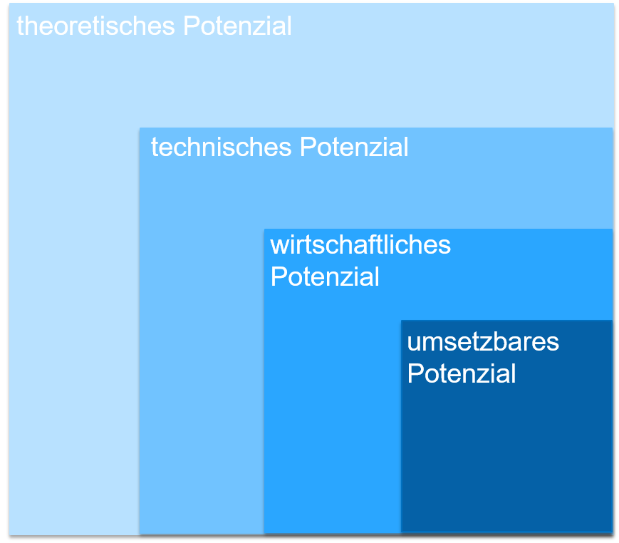
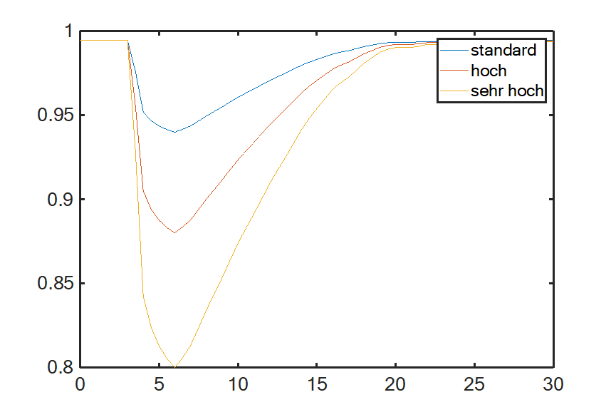

.. _Potenziale_Szenarien_Methoden_Zeitreihen_label:

Potenzialanalysen, Szenarien, Methoden und Zeitreihen
=====================================================

Da zum Zeitpunkt der Berechnungen der aktuelle Datenstand nur für Ende des Jahres 2019 zur Verfügung stand, wurde das Jahr 2019 als Referenzjahr verwendet. Als Referenz-Wetterjahr wurden Wetterdaten aus dem Jahr 2012 verwendet, da dieses als typisches Wetterjahr gilt. Für die erneuerbaren Energieanlagen wurde das technische Potenzial bestimmt.

Bildquelle: eigene Darstellung nach `Energieatlas Bayern <https://www.energieatlas.bayern.de/>`_

Bestandsanlagen
---------------

Die Standorte und Nennleistung der Bestandsanlagen für die erneuerbaren Technologien (Windkraftanlagen, Dachflächenphotovoltaikanlagen, Freiflächenphotovoltaikanlagen, Biomasseanlagen, Biogasanlagen und Wasserkraftanlagen) sowie Batteriespeicher wurden mit folgenden Quellen ermittelt:
  - `Stammdaten über EEG-Meldung der Anlagen <https://www.netztransparenz.de/EEG/Anlagenstammdaten>`_
  - `Marktstammdatenregister <https://www.marktstammdatenregister.de/MaStR>`_
  - `Energieatlas Bayern <https://www.energieatlas.bayern.de/>`_
  - `Energymap <http://www.energymap.info/>`_
  

Szenarien
---------

Ausgehend von den erneuerbaren Bestandsanlagen können im Tool die Potenziale für die verschiedenen erneuerbaren Technologien erhöht werden. Der Spielraum ist dabei das maximale technische Potenzial der jeweiligen Technologie. Die Ausgangslage ist der Status Quo - für die Stromerzeugung die installierte Leistung der jeweiligen erneuerbaren Energie; für den Strombedarf die Verbrauchswerte im Referenzjahr. Es wird kein Rückbau von erneuerbaren Energie Anlagen berücksichtigt.

Anlagenverteilung im Kartenbereich des Tools
--------------------------------------------

Sofern nicht anders vorgegeben werden Potenzialanlagen bei Erhöhung des jeweiligen Potenzials anhand des Stromertrags verteilt, d. h. Anlagen mit dem höchsten Stromertrag werden in absteigender Reihenfolge als Erstes platziert. Anlagen mit einer Nennleistung < 30 kWp werden aus Datenschutzgründen auf den Mittelpunkt der jeweiligen Postleitzahl der Gemeinde aggregiert dargestellt (betrifft größtenteils Photovoltaikdachanlagen).

Potenzialanalysen
-----------------

Verwendete Geodaten
...................

Flächennutzungsdaten
++++++++++++++++++++
	
	- Amtliches Digitales Basis-Landschaftsmodell (`ATKIS® Basis-DLM25 <https://www.ldbv.bayern.de/produkte/atkis-basis-dlm.html>`_)
	- `Corine Land Cover <https://land.copernicus.eu/pan-european/corine-land-cover/clc2018>`_
	- `Openstreetmap <https://www.openstreetmap.de/>`_

Daten für Verwaltungsgebiete
++++++++++++++++++++++++++++

	- Verwaltungsgebiete 1:250 000 (`BKG <https://gdz.bkg.bund.de/index.php/default/verwaltungsgebiete-1-250-000-ebenen-stand-31-12-vg250-ebenen-31-12.html>`_)

Windkraft
.........

Flächenpotenzialanalyse
+++++++++++++++++++++++

Es wurde eine Flächenpotenzialanalyse anhand vorhandener Flächennutzung (siehe verwendete Geodaten) durchgeführt. Für Windkraftanlagen geeignete Flächen werden ermittelt, indem vom Planungsraum Restriktionsflächen (Tabuzonen unterteilt in harte und weiche Kriterien sowie Abstandsregelungen), die nicht für Windkraftanlagen geeignet sind (unter anderem auf Grund von Naturschutz-, Lärmschutzverordnungen oder vorhandener Infrastruktur) ausgeschlossen werden. Die Restriktionsflächen und Abstandsregelungen werden anhand der Gebietskulisse Windkraft des LfU Bayern (`Quelle 1 <https://www.energieatlas.bayern.de/file/pdf/823/Erl%C3%A4uterungen-Nutzungsbedingungen_GK-Wind.pdf>`_ und `Quelle 2 <https://www.energieatlas.bayern.de/file/pdf/1213/GK-Wind_Themenuebersicht_EA-B.pdf>`_), Umweltbundesamt (`Potenzial der Windenergie an Land <https://www.umweltbundesamt.de/sites/default/files/medien/378/publikationen/potenzial_der_windenergie.pdf>`_, Teilflächennutzungspläne für Windkraft (z. B. `Eichstätt <https://www.eichstaett.de/rathaus/informationen/bauleitplanverfahren/flaechennutzungsplan/>`_ und `Pfaffenhofen a.d. Ilm <https://pfaffenhofen.de/dokumente/83/Sachlicher_Teilflaechennutzungsplan__Windkraft__zWJFRSx.PDF>`_ und Gesprächen mit Anlagenplanern bestimmt.

+----------------------------------------------------------+-----------------+
| **Harte Restriktionen (Tabuzonen)**                                        |
+==========================================================+=================+
| Restriktionsfläche                                       |  Puffer (in m)  |
+----------------------------------------------------------+-----------------+
| Siedlungsflächen                                         |       500       | 
+----------------------------------------------------------+-----------------+
| Verkehrs-, Sonder- und Hubschrauberlandeplätze           |        0        | 
+----------------------------------------------------------+-----------------+
| Naturschutzgebiete                                       |       200       | 
+----------------------------------------------------------+-----------------+
| Geschützte Landschaftsbestandteile                       |        0        |    
+----------------------------------------------------------+-----------------+
| SPA (Vogelschutzgebiete)                                 |       200       | 
+----------------------------------------------------------+-----------------+
| Trinkwasserschutzgebiete Zone I+II                       |        0        | 
+----------------------------------------------------------+-----------------+
| **Weiche Restriktionen (Tabuzonen)**                                       |
+----------------------------------------------------------+-----------------+
| Siedlungsfläche                                          | 1.000 bzw. 10-H | 
+----------------------------------------------------------+-----------------+
| Mischfläche                                              |       500       | 
+----------------------------------------------------------+-----------------+
| Industrie-/Gewerbefläche                                 |       300       |               
+----------------------------------------------------------+-----------------+
| Flächen besonderer Funktion                              | 1.000 bzw. 10-H |
+----------------------------------------------------------+-----------------+
| Friedhöfe                                                |       500       |
+----------------------------------------------------------+-----------------+
| Flora-Fauna-Habitat (FFH)-Gebiete                        |        0        | 
+----------------------------------------------------------+-----------------+
| Gewässer, stehend > 1 ha                                 |        65       |
+----------------------------------------------------------+-----------------+
| Fließgewässer 1. Ordnung                                 |        65       | 
+----------------------------------------------------------+-----------------+
| **Abwägungsflächen/Einzelfallprüfung**                                     |
+----------------------------------------------------------+-----------------+
| Schutzabstände zu FFH- und Vogelschutzgebieten           |  200 bis 1.200  |
+----------------------------------------------------------+-----------------+
| Landschaftsschutzgebiete                                 |        0        |
+----------------------------------------------------------+-----------------+
| Naturparke                                               |        0        |
+----------------------------------------------------------+-----------------+
| Biosphärenreservate                                      |        0        |
+----------------------------------------------------------+-----------------+
| Vorbehaltsgebiete für Natur und Landschaft               |        0        |
+----------------------------------------------------------+-----------------+
| RAMSAR-Gebiete                                           |        0        |
+----------------------------------------------------------+-----------------+
| Naturdenkmale                                            |        0        |
+----------------------------------------------------------+-----------------+
| Flächennaturdenkmale                                     |        0        |
+----------------------------------------------------------+-----------------+
| Wasserschutzgebiet Zone III                              |        0        | 
+----------------------------------------------------------+-----------------+
| Vorranggebiet für Wassergewinnung                        |        0        | 
+----------------------------------------------------------+-----------------+
| Vorrang- und Vorbehaltsgebiete für die Landwirtschaft    |        0        |    
+----------------------------------------------------------+-----------------+
| Vorrang- und Vorbehaltsgebiete für die Rohstoffgewinnung |        0        | 
+----------------------------------------------------------+-----------------+
| Technische Infrastruktur und Vorbelastung                                  | 
+----------------------------------------------------------+-----------------+
| Bundesautobahn                                           |       160       |    
+----------------------------------------------------------+-----------------+
| Bundesstraßen                                            |       100       |
+----------------------------------------------------------+-----------------+
| Staatsstraßen                                            |       100       | 
+----------------------------------------------------------+-----------------+
| Land- und Kreisstraßen                                   |        90       |    
+----------------------------------------------------------+-----------------+
| Gemeindestraßen                                          |        90       | 
+----------------------------------------------------------+-----------------+
| öffentliche und nicht öffentliche Straßen                |        90       | 
+----------------------------------------------------------+-----------------+
| Schienenwege                                             |       250       |
+----------------------------------------------------------+-----------------+
| Bahnanlagen                                              |       250       | 
+----------------------------------------------------------+-----------------+
| Flugverkehrsanlagen (zivile Nutzung)                     |      1.760      | 
+----------------------------------------------------------+-----------------+
| Flugverkehrsanlagen (militärische Nutzung)               |      5.000      | 
+----------------------------------------------------------+-----------------+
| Hochspannungs-/Freileitungen                             |       120       |                
+----------------------------------------------------------+-----------------+
| Photovoltaik-Freiflächenanlagen                          |        0        | 
+----------------------------------------------------------+-----------------+
| BGR-Breitbandstationen                                   |      5.000      | 
+----------------------------------------------------------+-----------------+
| Bayerischer Erdbebendienst                               |      5.000      |
+----------------------------------------------------------+-----------------+

Im Tool kann zwischen folgenden Abständen zu Siedlungsgebäuden variiert werden:
  - Mindestabstand 600 m (Quelle: `TA Lärm <http://www.verwaltungsvorschriften-im-internet.de/bsvwvbund_26081998_IG19980826.htm>`_)
  - 1000 m (Mindestabstand bei erfolgreichem Volksentscheid in Bayern sowie gängiger Abstand in anderen Bundesländern)
  - Abstand nach 10-H-Regelung (10-facher Abstand der Gesamthöhe der Windkraftanlage zu Siedlungsgebäuden - für die eingesetzten Referenzanlagen 2.130 m)
  
Außerdem können Potenzialanlagen die sich auf Waldflächen bzw. Flächen im Naturpark Altmühltal (siehe `Zonierungskonzept Naturpark Altmühltal <https://www.landkreis-eichstaett.de/media/zonierung/bericht_zk_altmuehltal_30112012.pdf>`_ befinden aktiviert bzw. deaktiviert werden.
In den Grundeinstellung wird der Abstand nach 10-H-Regelung verwendet, Anlagen können im Wald platziert werden und Anlagen im Naturpark Altmühltal werden ausgeschlossen.

Anlagenplatzierung
++++++++++++++++++

Optimierte Anlagenplatzierung durch `Fraunhofer IEE <https://www.iee.fraunhofer.de/>`_ nach `Umweltbundesamt <https://www.umweltbundesamt.de/sites/default/files/medien/376/publikationen/climate_change_38_2019_flaechenanalyse_windenergie_an_land.pdf>`_.
Die Platzierung erfolgt anhand der ermittelten Potenzialflächen und der Abstände durch Haupt- und Nebenwindrichtung (5- und 3-facher Rotordurchmesser).

Referenzanlage
++++++++++++++
  
  - Nennleistung: 3,3 MW
  - Nabenhöhe: 148 m 
  - Rotordurchmesser: 130 m 
  - Gesamthöhe: 213 m 

Randbedingungen
+++++++++++++++

  - Aus wirtschaftlichen Gründen werden Anlagen mit weniger als 1500 Volllaststunden ausgeschlossen.
  - Die Altersstruktur der bestehenden Windkraftanlagen wird vernachlässigt. Es wird kein Rückbau bzw. Repowering berücksichtigt.

Photovoltaik
............

Dachflächen
+++++++++++

:Annahme: 
	25 % aller geeigneten Dachflächen von Wohngebäuden (hauptsächlich Schrägdacher) und 50 % aller geeigneten Dachflächen von Industriegebäuden (hauptsächlich Flachdächer) sind für Photovoltaikanlagen geeignet. Bestimmung der Gesamtdachfläche der Region 10 über `Gebäudedatensätze von OpenStreetMap <http://download.geofabrik.de/>`_.
	Für 1 kWp werden 7 Quadratmeter Dachfläche benötigt (Quelle: `Fraunhofer ISE <https://www.ise.fraunhofer.de/content/dam/ise/de/documents/publications/studies/aktuelle-fakten-zur-photovoltaik-in-deutschland.pdf>`_).

Freiflächen
+++++++++++

Es wurde eine Flächenpotenzialanalyse anhand vorhandener Flächennutzung (siehe verwendete Geodaten) durchgeführt. Für Freiflächenanlagen geeignete Flächen werden ermittelt, indem von Potenzialflächen Restriktionsflächen (Tabuzonen unterteilt in harte und weiche Kriterien sowie Abstandsregelungen), die nicht für Freiflächenanlagen geeignet sind (unter anderem auf Grund von Naturschutzverordnungen oder vorhandener Infrastruktur) ausgeschlossen werden.
Die Potenzialflächen werden in Anlehnung an die aktuelle Förderkulisse nach
`§37 EEG <https://www.gesetze-im-internet.de/eeg_2014/__37.html>`_ (2017) sowie nach `ZSW 2019 <https://www.zsw-bw.de/fileadmin/user_upload/PDFs/Aktuelles/2019/politischer-dialog-pv-freiflaechenanlagen-studie-333788.pdf>`_ bestimmt.
Die Restriktionsflächen und Abstandsregelungen werden durch Berücksichtigung der aktuellen Rechtslage und Planungskriterien ermittelt (Quellen:
`BMVI - Räumlich differenzierte Flächenpotentiale für erneuerbare Energien in Deutschland <https://www.bbsr.bund.de/BBSR/DE/veroeffentlichungen/ministerien/bmvi/bmvi-online/2015/DL_BMVI_Online_08_15.pdf?__blob=publicationFile&v=1>`_, `Energieatlas Bayern <https://www.energieatlas.bayern.de/thema_sonne/photovoltaik/genehmigung.html>`_) sowie Kriterienkataloge für Freiflächenphotovoltaik (beispielsweise `Energieatlas Baden-Württemberg <https://www.energieatlas-bw.de/sonne/freiflachen/potenzialanalyse>`_ bestimmt.
Als Potenzialflächen sind unter anderem Ackerland und Grünland in benachteiligten Gebieten geeignet. Um diese Flächen zu bestimmen werden Acker- und Grünflächen (ermittelt aus den Flächennnutzungsdaten) mit Flächen sehr geringer Bodengüte (Werte < 50) laut Soil Quality Rating der Bundesanstalt für Geowissenschaften und Rohstoffe (`BGR 2014 <https://www.bgr.bund.de/DE/Themen/Boden/Ressourcenbewertung/Ertragspotential/Ertragspotential_node.html>`_) verschnitten.

+---------------------------------------+---------------+----------------+
| **Potenziell geeignete Flächen**                                       |
+=======================================+===============+================+
| Bezeichnung                           | Flächenpuffer | Abstandspuffer | 
|                                       | (in m)        | (in m)         |
+---------------------------------------+---------------+----------------+
| Ackerland in benachteiligten Gebieten |       0       |        0       | 
+---------------------------------------+---------------+----------------+
| Grünland in benachteiligten Gebieten  |       0       |        0       | 
+---------------------------------------+---------------+----------------+
| Seitenrandstreifen an Autobahnen      |      15       |       110      |
+---------------------------------------+---------------+----------------+
| Seitenrandstreifen an Bahnstrecken    |      15       |       110      | 
+---------------------------------------+---------------+----------------+
| Bestehende Konversionsflächen         |       0       |        0       | 
+---------------------------------------+---------------+----------------+
| **Harte Restriktionen**                                                |
+---------------------------------------+---------------+----------------+
| Bezeichnung                           | Flächenpuffer | Abstandspuffer | 
|                                       | (in m)        | (in m)         |
+---------------------------------------+---------------+----------------+
| Siedlungsflächen                      |       0       |       100      | 
+---------------------------------------+---------------+----------------+
| Bundesautobahnen                      |      15       |       40       |
+---------------------------------------+---------------+----------------+
| Weitere Straßen                       |      2,5      |       40       | 
+---------------------------------------+---------------+----------------+
| Wege                                  |       2       |        0       | 
+---------------------------------------+---------------+----------------+
| Bahnstrecken                          |       5       |       20       | 
+---------------------------------------+---------------+----------------+
| Bahnverkehrsanlagen                   |       0       |        0       | 
+---------------------------------------+---------------+----------------+
| Flächen für Flugverkehr               |       0       |       100      | 
+---------------------------------------+---------------+----------------+
| Fließgewässer                         |       0       |       10       | 
+---------------------------------------+---------------+----------------+
| Stehende Gewässer                     |       0       |       10       |
+---------------------------------------+---------------+----------------+
| Wald                                  |       0       |       10       | 
+---------------------------------------+---------------+----------------+
| Gehölz                                |       0       |       10       | 
+---------------------------------------+---------------+----------------+
| Naturschutzgebiete                    |       0       |        0       | 
+---------------------------------------+---------------+----------------+
| Nationalpark                          |       0       |        0       | 
+---------------------------------------+---------------+----------------+
| Biosphärengebiete                     |       0       |        0       | 
+---------------------------------------+---------------+----------------+
| Biotope                               |       0       |        0       |
+---------------------------------------+---------------+----------------+
| Überschwemmungsgebiete                |       0       |        0       |
+---------------------------------------+---------------+----------------+
| Naturdenkmale                         |       0       |        0       | 
+---------------------------------------+---------------+----------------+
| Wasserschutzgebietszonen              |       0       |        0       |   
+---------------------------------------+---------------+----------------+
| **Weiche Restriktionen**                                               |
+---------------------------------------+---------------+----------------+
| Bezeichnung                           | Flächenpuffer | Abstandspuffer | 
|                                       | (in m)        | (in m)         | 
+---------------------------------------+---------------+----------------+
| Biotopverbund                         |       0       |        0       | 
+---------------------------------------+---------------+----------------+
| FFH-Gebiete                           |       0       |        0       | 
+---------------------------------------+---------------+----------------+
| SPA (Vogelschutzgebiete)              |       0       |        0       | 
+---------------------------------------+---------------+----------------+
| Landschaftsschutzgebiete              |       0       |        0       |
+---------------------------------------+---------------+----------------+
| Wasserschotzgebietsszone II           |       0       |        0       | 
+---------------------------------------+---------------+----------------+
| Generalwildwegeplan                   |       0       |      1.000     | 
+---------------------------------------+---------------+----------------+

Randbedingungen
+++++++++++++++

  - Spezifischer Flächenbedarf 1,4 Hektar pro MWp (`ZSW 2019 <https://www.zsw-bw.de/fileadmin/user_upload/PDFs/Aktuelles/2019/politischer-dialog-pv-freiflaechenanlagen-studie-333788.pdf>`_ – gängige Werte zwischen 1,5 ha/MWp bis zu 2,5 ha/MWp. Bis zum Jahr 2030 sind u. a. aufgrund von Effizienzsteigerungen bis zu 0,8 ha/MWp möglich. Desweiteren wurde der spezifische Flächenbdarf von modernen Anlagen ermittelt).
  - Aus wirtschaftlichen Gründen werden nur Gebiete größer al 1 Hektar berücksichtigt.
  - Aus Gründen der Raumverträglichkeit (`ZSW 2019 <https://www.zsw-bw.de/fileadmin/user_upload/PDFs/Aktuelles/2019/politischer-dialog-pv-freiflaechenanlagen-studie-333788.pdf>`_) werden lediglich 1 % der gesamten Acker- und Grünflächen als Potenzialfläche für Freiflächenphotovoltaik freigegeben. Dies lässt sich im Tool deaktivieren, sodass die gesamte, geeignete Fläche genutzt werden kann (ca. 30 % der Acker- und Grünflächen).

Biomasse und Biogas
...................

Vorgehensweise nach Datenblättern vom Deutschen Biomasseforschungszetrum (DBFZ)

Randbedingungen
+++++++++++++++
  
  - Bestimmung des technischen Biomasse- bzw. Biogaspotenzials
  - Anbaukultur von Fruchtarten bzw. Energiepflanzen in der Region 10 wird nicht verändert
  - Keine Berücksichtigung von Teller-/Tank-Diskussion
  - Nachhaltiger Aufwuchs von Wäldern wird nicht beeinträchtigt (d. h. es wird nur Holz energetisch verwendet aus nutzbarem Einschlag sowie nachhaltigem Zuwachs)
  
Grundlegende Daten
++++++++++++++++++

  - `Abfallbilanz 2015 <https://www.abfallbilanz.bayern.de/index.asp>`_
  - `Regionalstatistik Viehhaltung <https://www.regionalstatistik.de/genesis/online/>`_
  - `Regionalstatistik Bodennutzungsarten <https://www.regionalstatistik.de/genesis/online/>`_
  - `Dritte Bundeswaldinventur <https://www.bundeswaldinventur.bayern.de/>`_
  - `Holzmarktbericht <https://www.stmelf.bayern.de/wald/holz/004816/index.php>`_
  - `Amt für Ernährung, Landwirtschaft und Forsten Ingolstadt-Pfaffenhofen a.d. Ilm <https://www.aelf-ip.bayern.de/index.php>`_
  - `Bayerische Landesanstalt für Wald und Forstwirtschaft <https://www.lwf.bayern.de/bwi/113474/index.php>`_

Technische Potenzialbestimmung für
++++++++++++++++++++++++++++++++++

   - `Altholz <https://www.dbfz.de/fileadmin/bioenergiedaten/content/datenblaetter/Datenblatt_Altholz.pdf>`_
   - `Bioabfall <https://www.dbfz.de/fileadmin/bioenergiedaten/content/datenblaetter/Datenblatt_Bioabfall.pdf>`_
   - `Gewerbliche Speiseabfälle <https://www.dbfz.de/fileadmin/bioenergiedaten/content/datenblaetter/Datenblatt_Gewerbliche_Speiseabfaelle.pdf>`_
   - `Grünabfall <https://www.dbfz.de/fileadmin/bioenergiedaten/content/datenblaetter/Datenblatt_Gruenabfall.pdf>`_
   - `Energiepflanzen <https://www.dbfz.de/fileadmin/bioenergiedaten/content/datenblaetter/Datenblatt_Energiepflanzen.pdf>`_
   - `Tierische Exkremente <https://www.dbfz.de/fileadmin/bioenergiedaten/content/datenblaetter/Datenblatt_Exkremente.pdf>`_
   - `Getreidestroh <https://www.dbfz.de/fileadmin/bioenergiedaten/content/datenblaetter/Datenblatt_Getreidestroh.pdf>`_
   - `Weingärten <https://www.dbfz.de/fileadmin/bioenergiedaten/content/datenblaetter/Datenblatt_Weingaerten.pdf>`_
   - `Grünanlagen <https://www.dbfz.de/fileadmin/bioenergiedaten/content/datenblaetter/Datenblatt_Gruenanlagen.pdf>`_
   - `Straßenbegleitflächen <https://www.dbfz.de/fileadmin/bioenergiedaten/content/datenblaetter/Datenblatt_Stra%C3%9Fenbegleitflaechen.pdf>`_
   - `Forst Einschlag <https://www.dbfz.de/fileadmin/bioenergiedaten/content/datenblaetter/Datenblatt_Forst_Einschlag.pdf>`_
   - `Forst Zuwachs <https://www.dbfz.de/fileadmin/bioenergiedaten/content/datenblaetter/Datenblatt_Forst_Zuwachs.pdf>`_
   
Bestimmung der Potentialstandorte
+++++++++++++++++++++++++++++++++

**Biogasanlagen**

1. Berücksichtigung von Standorten der Biogasanlagen im Bestand
2. Erstellen von Strombilanzen für jede Gemeinde anhand Stromverbrauch je Sektor und Einwohnerzahlen
3. Berechnung des Anteils erneuerbarer Energien für jede Gemeinde
4. Zielstandorte: Am Ortsrand und nah am Straßenrand
5. Verteilung der Anlagen in Gemeinden mit geringer installierter Leistung an Biogasanlagen und geringem Anteil erneuerbarer Energien
6. Verteilung der Anlagen in Gemeinden mit hohem Anteil an landwirtschaftlichen Flächen

Referenzanlage: Nennleistung 1 MW, doppelte Überbauung, flexible Betriebsweise

**Biomasseanlagen** 

1. Berücksichtigung von Standorten der Biomasseanlagen im Bestand
2. Verteilung der Potenzialanlagen in Gemeinden mit hoher Einwohnerzahl und Siedlungsdichte, da dort in der Regel am meisten Wärmebedarf vorliegt 

Referenzanlage: Nennleistung 6,1 MW, Strom- und Wärmeerzeugung 

Wasserkraft
...........

Das Wasserkraftpotenzial der Donau ist größtenteils ausgeschöpft (`Potenzialstudie E.ON Wasserkraft GmbH und Bayerische Elektrizitätswerke GmbH
<https://www.energieatlas.bayern.de/file/pdf/2054/potentialstudie_EON.pdf>`_
). Eine Potentialerhöhung ist nur durch Nachrüstung oder Modernisierung möglich. Das so rauszuholende Potential wurde anhand der Potenzialstudie und in Fachgesprächen mit dem `Bayerischen Landesamt für Umwelt
<https://www.lfu.bayern.de/index.htm>`_ diskutiert und auf 10 % festgelegt.

Tiefengeothermie
................

Die geologischen Voraussetzung für die Nutzung von Tiefengeothermie sind in der Region 10 nicht gegeben (`LfU Bayern
<https://www.lfu.bayern.de/index.htm>`_
).

Konventionelle Kraftwerke
.........................

Das `Kraftwerk Irsching
<https://www.uniper.energy/de/kraftwerk-irsching>`_ mit den Blöcken 3, 4 und 5 sowie das `Kraftwerk Ingolstadt
<https://www.uniper.energy/de/kraftwerk-ingolstadt>`_ mit den Blöcken 3 und 4 fallen unter die sogenannte Netzreserveverordnung und kommen derzeit ausschließlich in kritischen Netzsituation zum Einsatz.
Aus diesem Grund werden Konventionelle Anlagen im Energiewende-Tool nicht berücksichtigt.

Batteriespeicher
................

Quelle: `Bedarfsanalyse Energiespeicher 2 - Auswirkungen der räumlichen Verteilung von Anlagen zur Stromerzeugung und Bewertung von Energieausgleichstechnologien. Abschlussbericht <publica.fraunhofer.de/eprints/urn_nbn_de_0011-n-4843707.pdf>`_

Dezentrale Batteriespeicher (für Private Haushalte in Verbindung mit Photovoltaikanlagen)
+++++++++++++++++++++++++++++++++++++++++++++++++++++++++++++++++++++++++++++++++++++++++

Verteilung proportional zur Anzahl der Ein- und Zweifamilienhäuser (Quelle: Wohngebäudebestand (Alter, Größe, Wohneinheiten, Leerstand etc.) nach `Zensus 2011
<https://ergebnisse2011.zensus2022.de/datenbank/online/>`_).
Durchschnittliche Speichergröße:
 - Leistung: 3,25 kW
 - Kapazität: 6,25 kWh

Zentrale Batteriespeicher (Verteilung frei in der Region 10)
++++++++++++++++++++++++++++++++++++++++++++++++++++++++++++

Verteilung abhängig von Anzahl der Mittelspannungsnetze in Deutschland. Jedes zehnte Mittelspannungsnetz in Deutschland wird mit zentralen Stromspeichern ausgerüstet (In der Region 10 ca. 30 Mittelspannungsnetze).
Pro Standort je eine:
 - Lithium-Ionen Batterie (Leistung: 560 kW, Kapazität: 560 kWh)
 - Redox-Flow Batterie (Leistung: 200 kW, Kapazität: 1600 kWh)

Verbrauchsdaten Stromsektoren
-----------------------------

Es werden Verbrauchsdaten für die Sektoren Haushalte, Gewerbe, Handel, Dienstleistungen (GHD) und Industrie ermittelt.
Die Verbrauchdaten werden mittels des `disaggregator-Tools
<https://github.com/DemandRegioTeam/disaggregator>`_
(Lizenz: GPLv3) aus dem Projekt `DemandRegio
<https://www.ffe.de/themen-und-methoden/erzeugung-und-markt/735-demand-regio-harmonisierung-und-entwicklung-von-verfahren-zur-regionalen-und-zeitlichen-aufloesung-von-energienachfragen>`_ 
der Forschungsstelle für Energiewirtschaft e.V. (FfE) erzeugt.

Weitere Verbrauchsdaten
-----------------------

Wärmepumpen
...........

Wärmepumpenbestand in Deutschland und Bayern (Quelle: `Bundesverband Wärmepumpe (BDW e.V.)
<https://www.waermepumpe.de/presse/zahlen-daten/>`_
)
Grundsätzlich eignet sich die Region 10 für Grundwasser-, Sole- und Luftwärmepumpen (Quelle: `LfU Bayern
<https://www.lfu.bayern.de/index.htm>`_
, `BWP-Branchenstudie 2015
<https://www.waermepumpe.de/fileadmin/user_upload/waermepumpe/07_Publikationen/2016-04-08_Branchenprognose_2015_web.pdf>`_ 
und Energienutzungspläne der Landkreise und Gemeinden in der Region 10).

Berechnung des Bestands und Potenzials der Region 10 anhand 
`Bevölkerungszahlen und -entwicklung
<https://www.ingolstadt.de/output/download.php?fid=3052.5144.1.PDF>`_
und Wohngebäudebestand (Alter, Größe, Wohneinheiten, Leerstand etc.) nach `Zensus 2011
<https://ergebnisse2011.zensus2022.de/datenbank/online/>`_
.

Referenzanlage: Jahresstromverbrauch ca. 3.600 kWh (Auswahl anhand temperaturabhängige Verbrauchszeitreihe und `Wärmepumpen Verbrauchsdatenbank
<https://www.waermepumpen-verbrauchsdatenbank.de/index.php?button=verbrauch>`_
für eine durchschnittliche Wohnfläche von 100 m²) .

Elektromobilität
................

Durchschnittliche Jahresfahrleistung 2019
+++++++++++++++++++++++++++++++++++++++++

13.602 km pro Fahrzeug (Quelle: `Kraftfahrtbundesamt
<https://www.kba.de/DE/Statistik/Kraftverkehr/VerkehrKilometer/vk_inlaenderfahrleistung/vk_inlaenderfahrleistung_inhalt.html>`_

Aufgrund der hohen PKW-Dichte der Stadt Ingolstadt (`Platz 1 im Vergleich zu anderen bayerischen Großsstädten
<https://www.ingolstadt.de/Home/Hohe-Pkw-Dichte-in-Ingolstadt.php?object=tx,2789.5&ModID=7&FID=3052.11361.1&NavID=2789.411>`_
) wurde im Tool eine durschnittliche Jahresfahrleistung von 13.500 km angenommen.

Anzahl von Verbrennerfahrzeugen und Elektrofahrzeugen 2019
++++++++++++++++++++++++++++++++++++++++++++++++++++++++++

Insgesamt 333.608 Fahrzeuge, davon 1.500 Elektrofahrzeuge (BEV - batteriebetriebener Elektromotor)
(Quelle: `Kraftfahrtbundesamt
<https://www.kba.de/DE/Statistik/Fahrzeuge/Bestand/ZulassungsbezirkeGemeinden/b_zulassungsbezirke_inhalt.html;jsessionid=11E3DF9FA389532B681BCE5D2C38B6FF.live11311?nn=2598042>`_
)

Durchschnittlicher Stromverbrauch Elektrofahrzeuge
++++++++++++++++++++++++++++++++++++++++++++++++++

17,5 kWh/100 km (Durchschnittswert der zugelassenen Elektrofahrzeugmodelle - eigene Berechnung mittels der technischen Datenblätter der Fahrzeuge)

Erzeugungszeitreihen
--------------------

Windkraft
.........

Berechnung von regional aufgelösten Zeitreihen anhand Wetterdaten aus dem Jahr 2012 und dem Wetter- und Klimamodell `COSMO-DWD <https://www.dwd.de/DE/forschung/wettervorhersage/num_modellierung/01_num_vorhersagemodelle/regionalmodell_cosmo_de.html>`_ durch das `Fraunhofer IEE <https://www.iee.fraunhofer.de/>`_ unter Berücksichtigung von drei Verschattungsstufen.

Photovoltaik
............

Normierte Einspeisezeitreihen von `renewables.ninja <https://www.renewables.ninja/>`_ (Wetterdatensatz: CM-SAF SARAH)
Anlagen-Setting:

  - 20 % Systemverluste nach `Fraunhofer ISE <https://www.ise.fraunhofer.de/content/dam/ise/de/documents/publications/studies/aktuelle-fakten-zur-photovoltaik-in-deutschland.pdf>`_
  - Neigung: 45° (Dachanlagen Schrägdach), 35° (Freiflächenanlagen/Dachanlagen Flachdach, optimale Ausrichtung für Deutschland)
  - Ausrichtung: 180°, andere Ausrichtungen von Dächern wurde durch nachträgliche Ertragskorrektur mit Minderungsfaktor von 0,85 berücksichtigt (`FfE <https://www.ffe.de/download/article/464/Dissertation_Roger_Corradini.pdf>`_).

Biomasse und Biogas
...................

Biomasse
++++++++

Erzeugung abhängig von Jahreszeit (unterschiedliche Erzeugung je nach Sommer-, Winter- oder Übergangszeit), durchschnittlich 6.571 Volllaststunden. Vergleich mit Erzeugung von Bestandsanlangen in der Region 10.  

Biogas
++++++

Ermittlung von Erzeugunszeitreihen für flexiblen Betrieb der potentiellen Biogasanlagen mittels Ergebnissen aus dem Projekt SmartBio der Technischen Hochschule Ingolstadt (Beschreibung der Methodik in `Tagungsunterlagen Zukünftige Stromnetze 2021 Seite 224-245
<https://www.zukunftsnetz.net/konferenz/tagungsunterlagen>`_).

Wasserkraft
...........

Es wird eine konstante Einspeiseleistung über das gesamte Jahr für alle Wasserkraftanlagen angenommen. Für die mittlere Jahresvollaststundenzahl wurden die bisherigen Werte der Bestandsanlagen ermittelt und verwendet (Mittelwert 5978 Volllaststunden).

Verbrauchszeitreihen
--------------------

Haushalte, Gewerbe, Handel, Dienstleistungen, Industrie
.......................................................

Erzeugung von stündlichen, normierten Verbrauchszeitreihen mit Hilfe von `Standardlastprofilen Strom
<https://www.bdew.de/energie/standardlastprofile-strom/>`_ 
des Bundesverbands der Energie- und Wasserwirtschaft (BDEW) (H0 für Haushalte, G0 für GHD, Stufenlastprofil für industrielle Verbraucher) und mittels `oemof-demandlib
<https://github.com/oemof/demandlib>`_.

Wärmepumpen
...........

Erzeugung und Verwendung eines Temperaturabhängigen Lastprofils (Quelle: `Stadtwerke München
<https://www.swm-infrastruktur.de/strom/netzzugang/bedingungen/waermepumpe>`_
/`Neustadtwerke
<https://www.neustadtwerke.de/temperaturabhaengige-lastprofile-tlp.html>`_
und `Wetterdaten der Region 10
<https://meteostat.net/de>`_)

Elektromobilität
................

Generierung einer Lastzeitreihe unter folgenden Randbedingungen:
++++++++++++++++++++++++++++++++++++++++++++++++++++++++++++++++

:Durchschnittliche tägliche Fahrtstrecke:
    
	Arbeitsweg: 10 km Hinweg, 10 km Rückweg 
	Wochenende: 10 km
	(`Mobilität in Deutschland 2017 <http://www.mobilitaet-in-deutschland.de/publikationen2017.html>`_)

:Fahrtbeginn Hinweg und Rückweg:
    
	Anhand der `Sozialversicherungspflichtigen Beschäftigten <https://www.ingolstadt.de/media/custom/3052_153_1.PDF?1530019516>`_ in der Region 10
	Aufteilung der Beschäftigten nach Schichtsystem (Wechselschicht, Normalschicht, Nachtschicht)
	Berücksichtigung von Nicht-Sozialversicherungspflichtigen Beschäftigten (Studenten, Hausfrauen, etc.)
	
:Ladestrategie:
    
	Durchschnittliche Ladeleistung 11 kW
	Beginn des Ladevorgangs nach der Arbeit bei Ankunft Zuhause abhängig vom jeweiligen Schichtende

