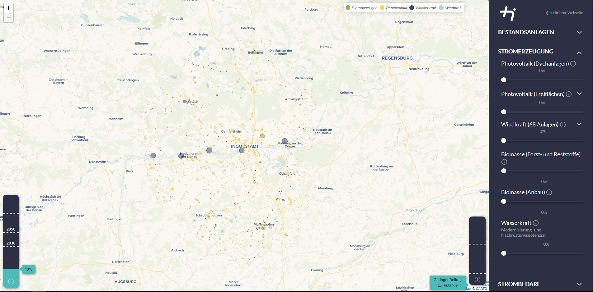
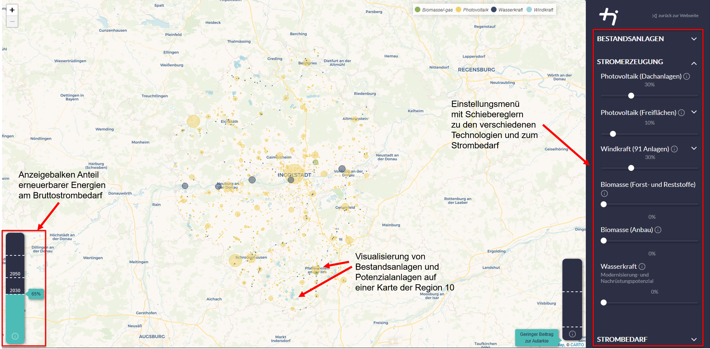
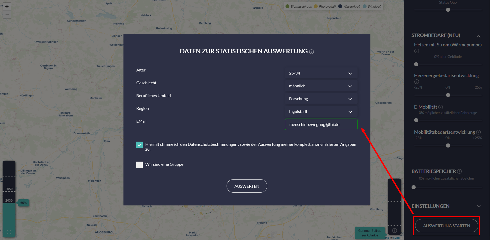

.. _Verwendung_label:

Verwendung
==========

Auf der Startseite des `Energiewende-Regionalisieren-Tools
<https://energiewende-regionalisieren.de/>`_ gibt es eine kurze Einführung zur Benutzung des Tools in Form eines `Video-Tutorials
<https://www.youtube.com/watch?v=E-7brTs_JOU>`_. Zusätzlich wird hier die Bedienung kurz erläutert.
   

Aufbau des Tools
----------------

Im Anwendungsbildschirm des Tools Energiewende regionalisieren gibt es unterschiedliche Funktionen und Optionen, um sich seine eigene Energiewendevision zu erstellen. Zu sehen ist eine Karte der Region 10, auf der Punkte mit unterschiedlichen Farben dargestellt sind. Die Punkte zeigen die Standorte von Bestandsanlagen der verschiedenen erneuerbaren Energien, die sich in der Region befinden (Status Quo Anzeige). In der unteren rechten Ecke befindet sich ein Balken, der anzeigt wie viel Anteil erneuerbarer Energien am Bruttostrombedarf mit den gewählten Einstelllungen erreicht werden und dient somit als Anzeige inwiefern die politischen Ziele der Bundesregierung in der Region 10 eingehalten werden können. Im Status Quo befindet sich dieser Wert bei 40 % und kann durch die gewählten Einstellungen verändert werden. Auf der rechten Seite des Tools befindet sich das Einstellungsmenü, in dem Einstellungen zu verschiedenen Optionen der Energiewende getätigt werden können, um so zu der eigenen Energiewende Vision zu gelangen. Im Einstellungsmenü gibt es ausklappbare Untermenüs zu Bestandsanlagen, Stromerzeugung, Strombedarf, Strombedarf (NEU) und Einstellungen. Im Untermenü Bestandsanlagen können sie die einzelnen erneuerbaren Technologien auf der Karte ein- oder ausblenden. Wird das Untermenü zur Stromerzeugung ausgeklappt, stehen verschiedene Schieberegler zu den einzelnen erneuerbaren Technologien zur Verfügung mit denen das jeweilige Ausbaupotential und die daraus resultierende installierte Leistung der Technologie eingestellt werden kann. 

   
Wird das Potential einer erneuerbaren Energie erhöht, entstehen neue potentielle Anlagen auf technisch möglichen Standorten (mehr dazu im Kapitel :ref:`Potenziale_Szenarien_Methoden_Zeitreihen_label`.) auf der Karte und der Anteil der erneuerbaren Energien wird erhöht. In den Untermenüs Strombedarf und Strombedarf (neu) kann der nötige Strombedarf der Sektoren Haushalte, Gewerbe, Handel und Dienstleistungen, Industrie sowie der Strombedarf, der für einen Ausbau von Wärmepumpen und Elektromobilität benötigt wird eingestellt werden. Des Weiteren kann das Potential von Batteriespeichern in der Region 10 erhöht werden und damit der Autarkiegrad der Region gesteigert werden. Das Untermenü Einstellungen bietet u. a. die Optionen einen Expertenmodus einzuschalten sowie die Skalierung der angezeigten Standortgröße anhand der zugehörigen installierten Leistung zu aktivieren bzw. deaktivieren.

Bei Beendigung der Einstellungen zur eigenen Energiewendevision besteht die Möglichkeit eine Auswertung zu starten. Durch Aktivierung der Auswertung wird das von der THI entwickelte Energiesystemmodell gestartet durch das detailliertere Grafiken und Informationen (u. a. stündlich aufgelöste Energie- und Leistungsbilanz, mehr dazu im Kapitel :ref:`Auswertung_label`) zur eigenen Energiewendevision bezogen werden können (Dazu öffnet sich ein Pop-Up-Fenster mit einer PDF-Datei). Hier besteht zudem die Möglichkeit eigene Daten (u. a. Alter, Geschlecht) einzutragen und anonymisiert speichern zu lassen, sodass diese von der THI für eine statistische Auswertung genutzt und an Interessensvertreter wie z. B. die Politik widergespiegelt werden können. 

